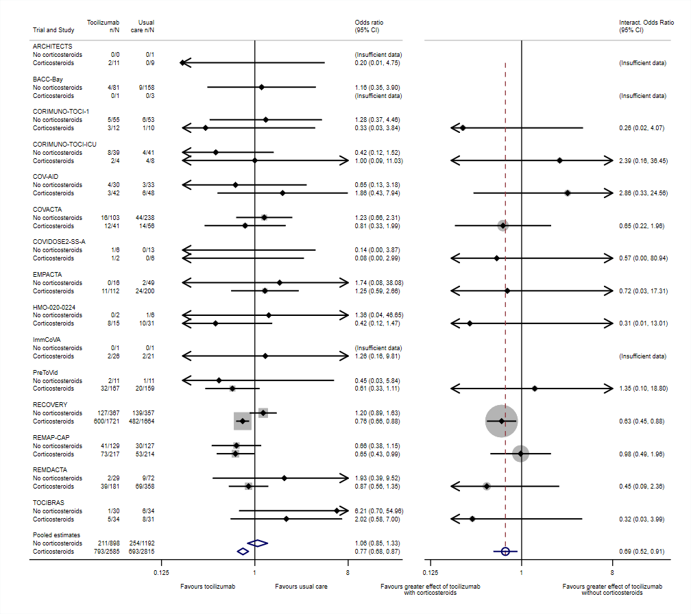

<a href ="https://www.mrcctu.ucl.ac.uk/"></a>

# metafloat
 v0.15  30aug2023

# A Stata package to estimate covariate interactions and subgroup-specific treatment effects in meta-analysis

Meta-analysis is a statistical technique for combining results from multiple independent studies, with the aim of estimating a single overall effect. However, it can also be used for assessing how treatment effects vary across participant subgroups. Ideally, this assessment will be based on treatment-covariate interaction effects derived _within each trial separately_, so that the pooled effects are free from aggregation bias. In particular, `metafloat` provides a simple way of estimating pooled interactions and "floating" subgroup-specific treatment effects from a set of observed (published, or otherwise pre-aggregated) treatment effects by trial and by subgroup.

See [Godolphin et al (2023)](https://doi.org/10.1002/jrsm.1590) for more information on the underlying methodology.

# Installation

To install the package directly from GitHub, type from within Stata:

    . net describe metafloat, from("https://raw.githubusercontent.com/UCL/metafloat/master/src/")

# Usage and documentation

Currently, documentation on usage and options may be found in the documentation files within Stata.  After installation, type in Stata:

    . help metafloat

# Example
A "two-panel" subgroup and interaction forest plot, as proposed by [Godolphin et al. (2023)](https://doi.org/10.1002/jrsm.1590)

Data taken from Supplementary Appendix 2, and displayed in Figure 1, of Godolphin et al (as above).
Data originally presented in Supplement 2, page 14, of [Shankar-Hari et al. (2021)](https://doi.org/10.1001/jama.2021.11330).

Note that this same example is used to demonstrate the `metan` and `forestplot` commands within the [metan GitHub pages](https://github.com/UCL/metan/main/Examples/Example5.md), but without using `metafloat` directly (and without generating subgroup-specific treatment effects free from aggregation bias). It may be seen that far more lines of code are needed.

<a href ="https://github.com/UCL/metafloat/blob/main"></a>

```Stata
* Example generated by -dataex-. For more info, type help dataex
clear
input str17 TrialName byte Subgroup int(n0 e0 n1 e1)
"ARCHITECTS"        0    0   0    1   0
"ARCHITECTS"        1   11   2    9   0
"BACC-Bay"          0   81   4  158   9
"BACC-Bay"          1    1   0    3   0
"CORIMUNO-TOCI-1"   0   55   5   53   6
"CORIMUNO-TOCI-1"   1   12   3   10   1
"CORIMUNO-TOCI-ICU" 0   39   8   41   4
"CORIMUNO-TOCI-ICU" 1    4   2    8   4
"COV-AID"           0   30   4   33   3
"COV-AID"           1   42   3   48   6
"COVACTA"           0  103  16  238  44
"COVACTA"           1   41  12   56  14
"COVIDOSE2-SS-A"    0    6   1   13   0
"COVIDOSE2-SS-A"    1    2   1    6   0
"EMPACTA"           0   16   0   49   2
"EMPACTA"           1  112  11  200  24
"HMO-020-0224"      0    2   0    6   1
"HMO-020-0224"      1   15   8   31  10
"ImmCoVA"           0    1   0    1   0
"ImmCoVA"           1   26   2   21   2
"PreToVid"          0   11   2   11   1
"PreToVid"          1  167  32  159  20
"RECOVERY"          0  367 127  357 139
"RECOVERY"          1 1721 600 1664 482
"REMAP-CAP"         0  129  41  127  30
"REMAP-CAP"         1  217  73  214  53
"REMDACTA"          0   29   2   72   9
"REMDACTA"          1  181  39  358  69
"TOCIBRAS"          0   30   1   34   6
"TOCIBRAS"          1   34   5   31   8
end

generate long f1 = n1 - e1
generate long f0 = n0 - e0
quietly metan e1 f1 e0 f0, or nogr keeporder

label variable Trial Trial
label variable Subgroup `""Corticosteroid use""'
metafloat _ES _seES, study(Trial) subgroup(Subgroup) fixed clear keepvars(e1 n1 e0 n0) 

gen counts0 = strofreal(cond(missing(e0), 0, e0)) + "/" + strofreal(cond(missing(n0), 0, n0)) if inlist(_y_USE, 1, 2)
gen counts1 = strofreal(cond(missing(e1), 0, e1)) + "/" + strofreal(cond(missing(n1), 0, n1)) if inlist(_y_USE, 1, 2)
label variable counts0 `""Usual care" "n/N""'
label variable counts1 `""Tocilizumab" "n/N""'

forestplot, prefix(_y) labels(_LABELS) or nowt lcols(counts0 counts1) keepall ///
	favours("Favours tocilizumab" " " # "Favours usual care" " ") ///
	xlabel(.125 "0.125" 1 8) range(.125 8) cirange(.2 8) boxsca(50) texts(150) astext(50) savedims(A) graphregion(color(white)) scheme(s2color) name(left)

forestplot, prefix(_yInt) interaction usedims(A) nonames eform effect("Interact. Odds Ratio") keepall nowt ///
	favours("Favours greater effect of tocilizumab" "with corticosteroids" ///
	# "Favours greater effect of tocilizumab" "without corticosteroids", fp(8)) ///
	xlabel(.125 "0.125" 1 8) range(.125 8) cirange(.2 8) texts(150) graphregion(color(white)) scheme(s2color) name(right)

graph combine left right, imargin(zero) xsize(4.5) graphregion(color(white)) scheme(s2color)
```
